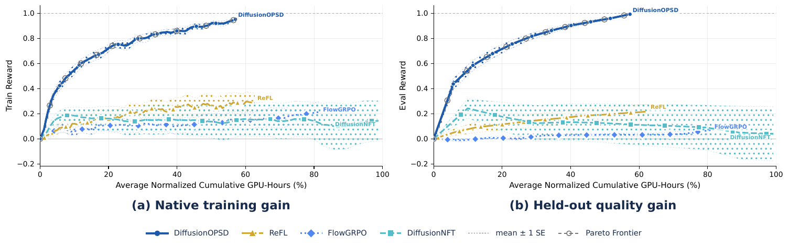
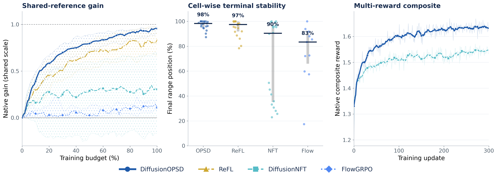
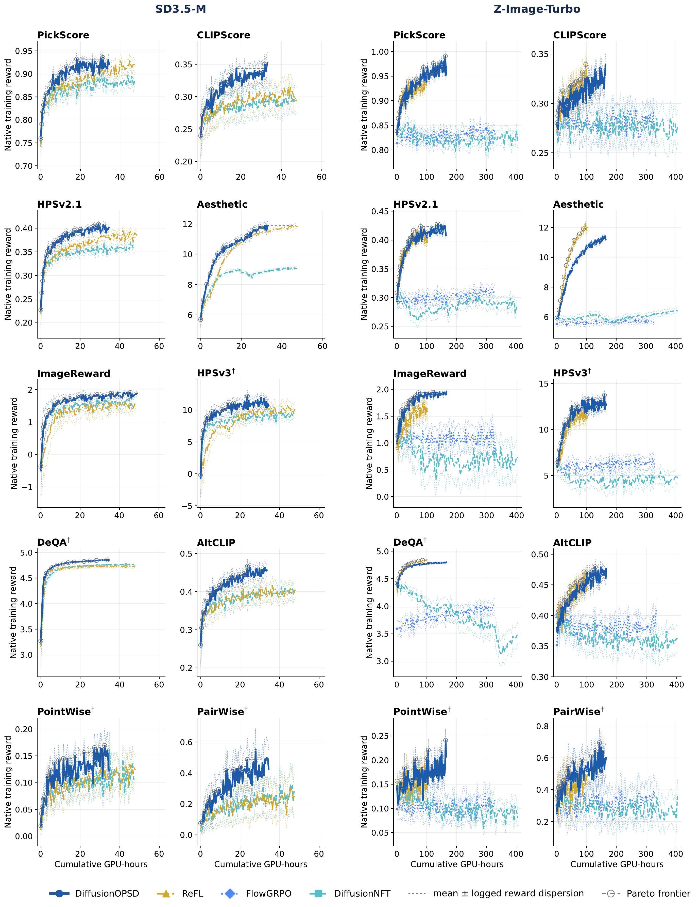
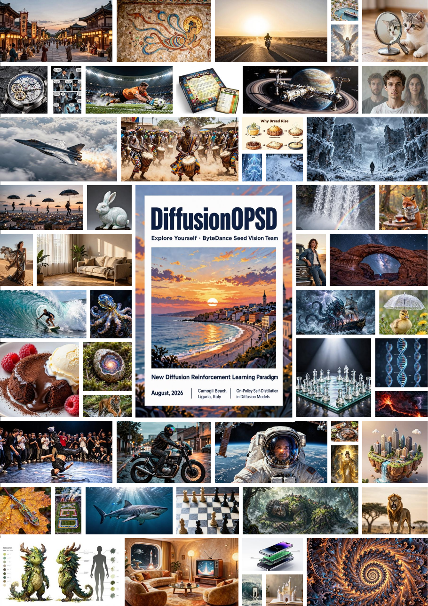

<div align="center">

# ✨ DiffusionOPSD: On-Policy Self-Distillation in Diffusion Models ✨

**Reward-guided diffusion post-training through explicit, continually refreshed intermediate targets**

<p align="center">
  Wei Zhou<sup>1,2</sup>, Xiongwei Zhu<sup>1</sup>, Lingdong Kong<sup>2</sup>, Bo Chen<sup>1</sup>, Lei Zhang<sup>3</sup>, Yongyuan Liang<sup>4</sup>, Xiaoxia Hou<sup>1</sup>, Ye Tian<sup>5</sup>,<br>
  Xian Sun<sup>6</sup>, Yingshuo Wang<sup>7</sup>, Linfeng Li<sup>2</sup>, Shengqiong Wu<sup>8</sup>, Leigang Qu<sup>2</sup>, Feng Li<sup>9</sup>, Wei Liu<sup>1,†</sup>, Julian McAuley<sup>3</sup>, Tat-Seng Chua<sup>2</sup>
</p>
<p align="center">
  <a href="https://seed.bytedance.com/"> <sup>1</sup> ByteDance Seed</a>
  &nbsp;&nbsp;·&nbsp;&nbsp;
  <a href="https://www.nus.edu.sg/"> <sup>2</sup> NUS</a>
  &nbsp;&nbsp;·&nbsp;&nbsp;
  <a href="https://ucsd.edu/"> <sup>3</sup> UC San Diego</a>
  &nbsp;&nbsp;·&nbsp;&nbsp;
  <a href="https://umd.edu/"> <sup>4</sup> UMD</a><br>
  <a href="https://www.hkust-gz.edu.cn/"> <sup>5</sup> HKUST (Guangzhou)</a>
  &nbsp;&nbsp;·&nbsp;&nbsp;
  <a href="https://www.duke.edu/"> <sup>6</sup> Duke</a>
  &nbsp;&nbsp;·&nbsp;&nbsp;
  <a href="https://www.berkeley.edu/"> <sup>7</sup> UC Berkeley</a>
  &nbsp;&nbsp;·&nbsp;&nbsp;
  <a href="https://www.ox.ac.uk/"> <sup>8</sup> Oxford</a>
  &nbsp;&nbsp;·&nbsp;&nbsp;
  <a href="https://hkust.edu.hk/"> <sup>9</sup> HKUST</a>
</p>
<p align="center"><sub><sup>†</sup> Corresponding author</sub></p>
<p align="center">
  <a href="#citation">
    
  </a>
  <a href="https://diffusionopsd.github.io/">
    
  </a>
  <a href="https://github.com/worldbench/DiffusionOPSD">
    
  </a>
  <a href="LICENSE">
    
  </a>
</p>

<br><br>



</div>

---

## 📌 Abstract

Diffusion reward optimization observes an image-level score only after a multi-step denoising trajectory, leaving a supervision gap at intermediate predictions. **DiffusionOPSD** closes this gap with an on-policy self-distillation loop. A frozen behavior policy collects low-noise query states and clean-output anchors; differentiable reward gradients construct bounded positive and negative targets around each anchor; the trainable policy then fits these detached targets under a finite update budget. An EMA refreshes the behavior policy before the next round of trajectories and targets.

This separation makes **target construction** and **finite realization** independently observable. Across SD3.5-M and Z-Image-Turbo, DiffusionOPSD achieves the best final held-out score in **19 of 20** reward-matched settings and reduces training GPU-hours relative to DiffusionNFT by **40%** and **63%**, respectively.

---

## 🌟 Highlights

- **On-policy query collection.** Supervision is built on states visited by the current behavior policy rather than offline or forward-noised substitutes.
- **Explicit reward-guided targets.** Normalized reward ascent and descent construct bounded positive and negative clean-output targets.
- **Detached finite fitting.** Reward/decoder graphs are discarded before policy fitting, separating target quality from model realization.
- **Continually refreshed supervision.** An EMA behavior policy regenerates trajectories, anchors, and targets after each outer update.
- **Two distinct backbones.** The release supports SD3.5-M at 512² and the native few-step Z-Image-Turbo regime at 1024².
- **Single- and mixed-reward training.** Public presets cover all seven open-weight evaluators and arbitrary positive weighted sums; the paper example uses PickScore/26 + CLIPScore + HPSv2.1.

---

## 🧠 Method

At query $s=(c,z_q,\sigma_q)$, the frozen behavior policy defines a clean-output anchor

$$
y_0 = z_q - \sigma_q v_{\mathrm{old}}(z_q,c,\sigma_q).
$$

DiffusionOPSD applies normalized reward-gradient steps inside a relative trust region,

$$
y_+ \leftarrow y_+ + h\frac{\nabla_y \widetilde R(y_+,c)}{\|\nabla_y \widetilde R(y_+,c)\|_2+\epsilon},
\qquad
y_- \leftarrow y_- - h\frac{\nabla_y \widetilde R(y_-,c)}{\|\nabla_y \widetilde R(y_-,c)\|_2+\epsilon},
$$

then fits the detached targets through positive and negative branches:

$$
\mathcal L_{\mathrm{OPSD}}
= \omega\frac{\|y_\theta^+-\bar y_+\|_2^2}{\gamma_+}
+ (1-\omega)\frac{\|y_\theta^- -\bar y_-\|_2^2}{\gamma_-}.
$$

The implementation uses detached mean-absolute residual normalizers, elementwise-mean squared residuals, and optimizes $c_{\mathrm{adv}}\mathcal L_{\mathrm{OPSD}}$ with $c_{\mathrm{adv}}=5$.

<p align="center">
  <a href="https://diffusionopsd.github.io/"></a>
</p>

Minimal pseudocode:

```python
trajectory = rollout(behavior_policy, prompt)
query = select_low_noise_state(trajectory)
anchor = behavior_policy.clean_output(query).detach()
weight = group_normalized_endpoint_weight(trajectory.reward)

positive = bounded_reward_ascent(anchor, reward).detach()
negative = bounded_reward_descent(anchor, reward).detach()

prediction = trainable_policy.clean_output(query.detach())
loss = detached_target_loss(prediction, anchor, positive, negative, weight)
loss.backward()
optimizer.step()
update_behavior_policy_ema()
```

---

## 📊 Main Results

Reward-specific checkpoints are evaluated on their matched held-out objective. Higher is better.

### SD3.5-M

| Method | Pick | CLIP | HPSv2.1 | Aes | ImgR | HPSv3 | DeQA | AltCLIP | Point | Pair |
|---|---:|---:|---:|---:|---:|---:|---:|---:|---:|---:|
| ReFL | 23.92 | 0.308 | 0.358 | **12.09** | 1.28 | 9.33 | 4.85 | 0.408 | 0.193 | 0.290 |
| DiffusionNFT | 23.43 | 0.298 | 0.336 | 9.11 | 1.46 | 9.14 | 4.76 | 0.412 | 0.199 | 0.323 |
| **DiffusionOPSD** | **24.94** | **0.340** | **0.390** | 12.08 | **1.76** | **13.34** | **4.94** | **0.450** | **0.214** | **0.465** |

### Z-Image-Turbo

| Method | Pick | CLIP | HPSv2.1 | Aes | ImgR | HPSv3 | DeQA | AltCLIP | Point | Pair |
|---|---:|---:|---:|---:|---:|---:|---:|---:|---:|---:|
| FlowGRPO | 22.96 | 0.275 | 0.305 | 5.46 | 1.01 | 7.11 | 4.51 | 0.394 | 0.217 | 0.420 |
| ReFL | 24.54 | 0.313 | 0.380 | 9.79 | 1.37 | 13.77 | 4.60 | 0.441 | 0.227 | 0.481 |
| DiffusionNFT | 22.28 | 0.280 | 0.277 | 6.07 | 0.58 | 1.58 | 3.37 | 0.363 | 0.166 | 0.357 |
| **DiffusionOPSD** | **25.15** | **0.320** | **0.390** | **10.74** | **1.79** | **14.44** | **4.78** | **0.451** | **0.243** | **0.551** |

### Training efficiency

Eight-GPU profiles; initialization, calibration, and evaluation are excluded.

| Backbone | Method | Seconds / update | Peak VRAM | GPU-h / 100 updates | Relative to NFT |
|---|---|---:|---:|---:|---:|
| SD3.5-M | DiffusionNFT | 212.4 | 47.8 GB | 47.2 | 1.00× |
| SD3.5-M | **DiffusionOPSD** | **126.9** | 50.0 GB | **28.2** | **0.60×** |
| Z-Image-Turbo | DiffusionNFT | 1826.2 | 49.9 GB | 405.8 | 1.00× |
| Z-Image-Turbo | **DiffusionOPSD** | **674.0** | 61.5 GB | **149.8** | **0.37×** |

<p align="center">
  
</p>

<table>
  <tr>
    <td width="50%" valign="top"></td>
    <td width="50%" valign="top"></td>
  </tr>
  <tr>
    <td align="center"><b>Native training rewards across ten objectives and two backbones.</b></td>
    <td align="center"><b>Held-out quality versus cumulative GPU-hours.</b></td>
  </tr>
</table>

---

## 🔬 Ablation Studies

The paper isolates target direction, implementation sensitivity, and train/evaluation CFG dependence. Reward-gradient targets outperform random, no-op, and rollout-residual controls, while the canonical settings remain stable across the tested implementation variants.

<p align="center">
  
</p>

---

## 🖼️ Qualitative Gallery

<p align="center">
  
</p>

---

## ⚙️ Installation

A recent Linux environment with CUDA GPUs is required for training. Python 3.10–3.11 is recommended.

```bash
git clone https://github.com/worldbench/DiffusionOPSD.git
cd DiffusionOPSD

conda create -n diffusionopsd python=3.11 -y
conda activate diffusionopsd

# Install the CUDA-matched PyTorch build first, then the standard reward stack.
pip install -e ".[rewards]"
# ImageReward's package metadata pins an obsolete timm; its inference code is
# compatible with the validated stack, so install the package without deps.
pip install --no-deps 'image-reward==1.5'

# Download the HPSv2.1 and Aesthetic checkpoint files used by the public presets.
export REWARD_CKPT_PATH="$PWD/reward_ckpts"
bash scripts/download_reward_weights.sh

# Materialize the exact 25,415-prompt Pick-a-Pic paper manifest.
# The training launchers also do this automatically.
python scripts/prepare_pickapic_prompts.py
```

Z-Image requires a Diffusers build containing `ZImagePipeline`. If it is absent from the installed release, install Diffusers from its official source checkout:

```bash
git clone https://github.com/huggingface/diffusers.git
pip install -e "./diffusers[torch]"
```

Optional environment variables:

```bash
export HF_HOME=/path/to/huggingface-cache
export WANDB_MODE=offline                    # default in train_public.sh
export REWARD_CKPT_PATH=/path/to/reward_ckpts
```

SD3.5-M is gated on Hugging Face; accept its model license and authenticate before the first download.

### Reward-model setup

DiffusionOPSD exposes all seven public evaluators used in the paper. Their model weights are resolved from the upstream projects and are not redistributed here.

#### Standard rewards

HPSv2.1, CLIPScore, PickScore, Aesthetic, and ImageReward share the standard environment:

```bash
pip install -e ".[rewards]"
# Keep the validated timm>=1.0 stack. ImageReward's runtime is compatible;
# only its old package metadata still pins timm==0.6.13.
pip install --no-deps 'image-reward==1.5'
export REWARD_CKPT_PATH="$PWD/reward_ckpts"
bash scripts/download_reward_weights.sh
```

CLIPScore, PickScore, and ImageReward download their remaining Hugging Face weights on first use. Because ImageReward declares its obsolete `timm==0.6.13` pin in package metadata, `pip check` reports that one intentional mismatch; `scripts/smoke_reward_gradient.py` validates the differentiable runtime path used by this release.

#### Heavy rewards: HPSv3 and DeQA

[HPSv3](https://github.com/MizzenAI/HPSv3) and [DeQA](https://github.com/zhiyuanyou/DeQA-Score) use 7B/8B evaluator stacks. Use a separate heavy-reward environment. Do not install HPSv3 with dependency resolution: its package metadata pins an older Transformers release, while the joint SD3.5/Z-Image path uses the validated Transformers 4.51 stack.

```bash
# In a fresh Python 3.10/3.11 environment, install a CUDA-matched PyTorch
# build first, then install the project without the standard reward extra.
pip install -e .
pip install --no-deps 'hpsv3==1.0.0'
pip install 'qwen-vl-utils>=0.0.8' omegaconf safetensors \
  einops 'timm>=1.0' fire 'trl==0.15.2' matplotlib tensorboard requests \
  packaging pyyaml sentencepiece icecream

python scripts/check_reward_setup.py --backbone sd35 --reward hpsv3
python scripts/check_reward_setup.py --backbone sd35 --reward deqa
python scripts/smoke_reward_gradient.py --reward hpsv3
python scripts/smoke_reward_gradient.py --reward deqa
```

The no-dependency HPSv3 install intentionally bypasses its training-oriented `transformers==4.45.2` and Deepspeed metadata. This release uses neither Deepspeed nor the HPSv3 training entry point; it validates reward inference and image gradients against Transformers 4.51.

Optional FlashAttention optimization, matched to the installed CUDA/PyTorch build:

```bash
pip install 'flash-attn==2.7.4.post1' --no-build-isolation
```

Weight resolution:

- HPSv3 downloads the pinned `MizzenAI/HPSv3` reward checkpoint and the Qwen2-VL-7B base model. Set `HPSV3_CHECKPOINT=/path/to/HPSv3.safetensors` for an offline copy, or `HPSV3_REVISION` to test a different upstream revision.
- DeQA downloads a pinned revision of [`zhiyuanyou/DeQA-Score-Mix3`](https://huggingface.co/zhiyuanyou/DeQA-Score-Mix3). Set `DEQA_MODEL_PATH=/path/to/DeQA-Score-Mix3` for an offline copy, or `DEQA_MODEL_REVISION` to test another revision.

#### Heavy-reward launch topology

All seven SD3.5-M rewards use eight colocated policy ranks. The DeQA differentiable target micro-batch is one; other presets retain their paper settings:

```bash
bash scripts/train_public.sh sd35 hpsv3
bash scripts/train_public.sh sd35 deqa
```

For Z-Image-Turbo, HPSv3 and DeQA use six policy ranks plus one differentiable reward-server rank (`NPROC=7`). The server returns both scalar rewards and image gradients:

```bash
bash scripts/train_public.sh zimage hpsv3
bash scripts/train_public.sh zimage deqa
```

The Z-Image DiffusionNFT and FlowGRPO launchers use the same six-policy-plus-one-server layout for HPSv3 and DeQA, but only request scalar rewards:

```bash
bash scripts/train_baseline.sh nft zimage hpsv3
bash scripts/train_baseline.sh flowgrpo zimage deqa
```

Custom DiffusionOPSD launchers must set the same topology:

```bash
export ZIMAGE_HEAVY_DIFF_BRIDGE=1
export PUBLIC_POLICY_WORLD_SIZE=6
export PUBLIC_LAUNCH_WORLD_SIZE=7
python -m torch.distributed.run --standalone --nproc_per_node=7 \
  scripts/train_opsd_zimage.py --config config/public.py:zimage_hpsv3
```

Run `scripts/check_reward_setup.py` before a long job. It checks interfaces, required local assets, Transformers compatibility, and policy/server topology without loading multi-gigabyte weights. Run `scripts/smoke_reward_gradient.py` once per reward to load the actual checkpoint and require a finite, nonzero image-space gradient.

---

## Public Runnable Matrix

The public presets use downloadable base models and reward models.

| Backbone | Public model | Preset | Public rewards | Default regime |
|---|---|---|---|---|
| SD3.5-M | `stabilityai/stable-diffusion-3.5-medium` | `config/public.py:sd35_<reward>` | HPSv2.1, CLIPScore, PickScore, Aesthetic, ImageReward, HPSv3, DeQA | 512², 10-step CFG-free rollout; 8 policy ranks |
| SD3.5-M | same | `config/public.py:sd35_open3` | PickScore/26 + CLIPScore + HPSv2.1 | joint Open3 objective |
| SD3.5-M | same | `config/mixed.py:sd35_<opsd\|nft>` | any positive weighted sum of two or more public rewards | configurable mixed-reward objective |
| Z-Image-Turbo | `Tongyi-MAI/Z-Image-Turbo` | `config/public.py:zimage_<reward>` | same seven evaluators | 1024², native few-step rollout; HPSv3/DeQA use 6 policy + 1 reward-server rank |

Paper-matched baseline presets:

| Method | Backbone | Preset | Public rewards | Budget |
|---|---|---|---|---|
| DiffusionNFT | SD3.5-M | `config/nft.py:sd3_<reward>` | all seven | 100 optimizer updates |
| FlowGRPO | SD3.5-M | `config/flowgrpo.py:sd35_clipscore` | CLIPScore control used for dynamics/efficiency analysis | 50 rollout rounds = 100 optimizer updates |
| DiffusionNFT | Z-Image-Turbo | `config/zimage.py:zimg_nft_<reward>` | all seven | 100 optimizer updates |
| FlowGRPO | Z-Image-Turbo | `config/zimage.py:zimg_flowgrpo_<reward>` | all seven | 50 rollout rounds = 100 optimizer updates |
| ReFL | both | `config/refl.py:<backbone>_<reward>` | all seven | 100 optimizer updates |

### Configuration check (no model weights, no GPU)

```bash
python scripts/check_release.py
```

### Short end-to-end check

This is a real model/reward/gradient run and downloads the selected weights on first use. `SMOKE_TEST=1` keeps the paper's trajectories-per-prompt grouping but uses one group-complete rollout batch instead of the full 48-group update; FlowGRPO uses two batches to exercise both PPO optimizer windows.

```bash
SMOKE_TEST=1 NPROC=8 UPDATES=1 bash scripts/train_public.sh sd35 hpsv2
SMOKE_TEST=1 NPROC=8 UPDATES=1 bash scripts/train_public.sh zimage hpsv2

# Heavy reward path: NPROC=7 is selected automatically for Z-Image.
SMOKE_TEST=1 UPDATES=1 bash scripts/train_public.sh zimage hpsv3
SMOKE_TEST=1 UPDATES=1 bash scripts/train_public.sh zimage deqa

# Baselines. FlowGRPO performs two optimizer updates in one smoke rollout.
SMOKE_TEST=1 UPDATES=1 bash scripts/train_baseline.sh nft zimage hpsv2
SMOKE_TEST=1 UPDATES=2 bash scripts/train_baseline.sh flowgrpo sd35 clipscore
SMOKE_TEST=1 UPDATES=2 bash scripts/train_baseline.sh flowgrpo zimage hpsv2
```

Before loading a diffusion backbone, verify each evaluator's exact target-construction path with one image:

```bash
python scripts/smoke_reward_gradient.py --reward hpsv2
# Repeat for: clipscore, pickscore, aesthetic, imagereward, hpsv3, deqa
```

### Full reward-specific training

```bash
NPROC=8 UPDATES=100 OUTPUT_DIR=outputs/sd35_hpsv2 \
  bash scripts/train_public.sh sd35 hpsv2

NPROC=8 UPDATES=100 OUTPUT_DIR=outputs/zimage_hpsv2 \
  bash scripts/train_public.sh zimage hpsv2
```

### Baseline training

```bash
# The matched SD3.5-M FlowGRPO CLIPScore control.
NPROC=8 UPDATES=100 bash scripts/train_baseline.sh flowgrpo sd35 clipscore

# Reward-specific Z-Image DiffusionNFT and FlowGRPO runs.
for reward in hpsv2 clipscore pickscore aesthetic imagereward hpsv3 deqa; do
  UPDATES=100 bash scripts/train_baseline.sh nft zimage "$reward"
  UPDATES=100 bash scripts/train_baseline.sh flowgrpo zimage "$reward"
done
```

Public trainers save every 10 optimizer updates and at the final update by default. FlowGRPO uses the optimizer-step counter rather than rollout-round count, and smoke runs disable checkpoint writing automatically. Set `--config.save_freq=1` only when every intermediate curve point is required.

### Mixed-reward training

The mixed-reward launcher accepts any number of distinct public rewards and an optional positive weight for each one. Both DiffusionOPSD and DiffusionNFT use exactly the same weighted endpoint objective; DiffusionOPSD also uses the same weighted sum for its differentiable target-construction gradient.

The script defaults to the paper's three-reward objective. PickScore is normalized by `/26` inside its scorer, so unit weights implement `PickScore/26 + CLIPScore + HPSv2.1`:

```bash
NPROC=8 UPDATES=300 OUTPUT_DIR=outputs/mixed_opsd \
  bash scripts/train_mixed_reward.sh opsd

NPROC=8 UPDATES=300 OUTPUT_DIR=outputs/mixed_nft \
  bash scripts/train_mixed_reward.sh nft
```

To select any other combination, pass `MIXED_REWARDS` as `reward[=weight],...`:

```bash
MIXED_REWARDS='clipscore=1,hpsv2=0.5,aesthetic=0.1,imagereward=0.25' \
NPROC=8 UPDATES=300 OUTPUT_DIR=outputs/mixed_custom \
  bash scripts/train_mixed_reward.sh opsd
```

Supported names are `hpsv2`, `clipscore`, `pickscore`, `aesthetic`, `imagereward`, `hpsv3`, and `deqa`. Terms without `=weight` default to `1`. Weights act on each evaluator's native output scale; there is no automatic cross-reward normalization beyond the scorer's paper-matched PickScore `/26`. Duplicate rewards, non-positive weights, unknown names, and fewer than two rewards fail before `torchrun`. Combinations containing HPSv3 or DeQA retain their heavier environment and memory requirements. The fixed `bash scripts/train_public.sh sd35 open3` command remains a backward-compatible alias for the paper objective.

### Use your own prompt split

Expected format: one prompt per line in `train.txt` and `test.txt`.

```text
/path/to/prompts/
├── train.txt
└── test.txt
```

```bash
NPROC=8 UPDATES=100 bash scripts/train_public.sh sd35 clipscore \
  --config.dataset=/path/to/prompts
```

The default is already the paper split: a pinned text-only Hugging Face dataset plus the bundled reconstruction recipe creates the exact 25,415-prompt manifest and verifies SHA-256 `39d94f…aa7100c`.

---

## 🚀 Direct Launch

The helper above is equivalent to:

```bash
export PUBLIC_POLICY_WORLD_SIZE=8
python -m torch.distributed.run --standalone --nnodes=1 --nproc_per_node=8 \
  scripts/train_opsd_ri_sd3.py \
  --config config/public.py:sd35_hpsv2 \
  --config.num_epochs=100 \
  --config.save_dir=outputs/sd35_hpsv2
```

Resume from a saved checkpoint:

```bash
NPROC=8 UPDATES=100 bash scripts/train_public.sh sd35 hpsv2 \
  --config.resume_from=outputs/sd35_hpsv2/checkpoints/checkpoint-50
```

---

## 📏 Evaluation

The SD3.5 evaluator regenerates a fixed prompt set once, then scores the same images with the selected reward models:

```bash
python scripts/cross_eval.py \
  --ckpt outputs/sd35_hpsv2/checkpoints/checkpoint-100/lora \
  --config sd35_hpsv2 \
  --config_file config/public.py \
  --prompts data/drawbench/test.txt \
  --prompt_set_name drawbench \
  --protocol_name drawbench_flow40_cfgfree \
  --num_steps 40 \
  --guidance_scale 1.0 \
  --rewards hpsv2,clipscore,pickscore,aesthetic \
  --pickscore_scale raw \
  --out outputs/sd35_hpsv2/drawbench.json
```

Use `scripts/native_eval.py` for native Z-Image generation and `scripts/eval_diversity.py` for matched-prompt reward/diversity analysis.

---

## 🧩 Supported Backbones

| Backbone | Trainer | Sampler | Student update |
|---|---|---|---|
| SD3.5-M | `scripts/train_opsd_ri_sd3.py` | deterministic DPM2 rollout; flow-40 evaluation | PEFT LoRA |
| Z-Image-Turbo | `scripts/train_opsd_zimage.py` | native FlowMatchEuler few-step rollout | PEFT LoRA |

Canonical DiffusionOPSD defaults live in `config/opsd_defaults.py`:

| Setting | SD3.5-M | Z-Image-Turbo |
|---|---:|---:|
| query noise `σ*` | 0.278 | 0.273 |
| target radius `ρ` | 0.10 | 0.10 |
| target steps | 2 | 2 |
| branch coefficient `β` | 1.0 (0.1 for Open3) | 1.0 |
| positive / negative targets | both | both |
| certification | off | off |
| policy-reference MSE | off | off |

---

## 📁 Repository Layout

```text
.
├── assets/                  # README figures and qualitative gallery
├── config/
│   ├── public.py            # public runnable presets
│   ├── mixed.py             # arbitrary weighted mixed-reward presets
│   ├── flowgrpo.py          # matched SD3.5-M FlowGRPO control
│   ├── refl.py              # public ReFL presets
│   ├── opsd_defaults.py     # canonical method defaults
│   ├── nft.py               # SD3.5 base configuration
│   └── zimage.py            # Z-Image base configuration
├── data/
│   ├── pickapic_recipe.json # exact paper-split reconstruction recipe
│   └── drawbench/           # fixed 1,000-prompt held-out manifest
├── src/
│   ├── diffusers_patch/     # samplers, log-prob utilities, Z-Image rollout
│   ├── rewards.py           # reward registry
│   ├── metrics.py           # shared WandB → metrics.jsonl instrumentation
│   ├── experiment_io.py     # checkpoint/resume/provenance helpers
│   └── *_scorer.py          # differentiable reward adapters
├── scripts/
│   ├── train_public.sh      # public launcher
│   ├── train_mixed_reward.sh # mixed DiffusionOPSD / DiffusionNFT launcher
│   ├── train_baseline.sh    # DiffusionNFT / FlowGRPO launcher
│   ├── train_refl.sh        # public ReFL launcher
│   ├── prepare_pickapic_prompts.py
│   ├── download_reward_weights.sh
│   ├── check_release.py     # CPU-only config validation
│   ├── train_opsd_ri_sd3.py
│   ├── train_opsd_zimage.py
│   ├── cross_eval.py
│   └── native_eval.py
├── opd/                     # DanceOPD, DiffusionOPD, FlowOPD
├── LICENSE
└── pyproject.toml
```

## 🧪 Baselines

The launcher above covers DiffusionNFT and FlowGRPO. ReFL and the teacher-distillation baselines use their dedicated launchers:

```bash
# ReFL: 48 prompt groups × K trajectories/update (K=24 SD3.5, K=12 Z-Image).
bash scripts/train_refl.sh sd35 hpsv2
bash scripts/train_refl.sh zimage hpsv2

# OPD: train the three 100-update specialists, then run a short full-flow pilot.
for reward in pickscore clipscore hpsv2; do
  bash scripts/train_public.sh sd35 "$reward"
done
METHODS="danceopd diffusionopd flowopd" bash opd/benchmark_opd.sh
METHOD=danceopd bash opd/launch_opd.sh
```

See [`opd/README.md`](opd/README.md) for DanceOPD, DiffusionOPD, and FlowOPD. Their second stage uses the same three frozen specialists, 300 updates, and the paper's calibrated 2,688/528/544 samples per update.

---

## 📝 Citation

```bibtex
@article{zhou2026diffusionopsd,
  title   = {On-Policy Self-Distillation in Diffusion Models},
  author  = {Zhou, Wei and Zhu, Xiongwei and Kong, Lingdong and Chen, Bo and Zhang, Lei and Liang, Yongyuan and Hou, Xiaoxia and Tian, Ye and Sun, Xian and Wang, Yingshuo and Li, Linfeng and Wu, Shengqiong and Qu, Leigang and Li, Feng and Liu, Wei and McAuley, Julian and Chua, Tat-Seng},
  year    = {2026}
}
```

---

## 🙏 Acknowledgements

This release builds on Hugging Face [Diffusers](https://github.com/huggingface/diffusers) and [PEFT](https://github.com/huggingface/peft), [Flow-GRPO](https://github.com/yifan123/flow_grpo), [DiffusionNFT](https://github.com/NVlabs/DiffusionNFT), [ReFL/ImageReward](https://github.com/zai-org/ImageReward), and [DanceOPD](https://github.com/worldbench/DanceOPD). We thank the maintainers of the base models, public reward models, and evaluation suites used in this project.

## 📄 License

Released under the [Apache License 2.0](LICENSE). See [NOTICE](NOTICE) for third-party attribution and weight-license boundaries.
